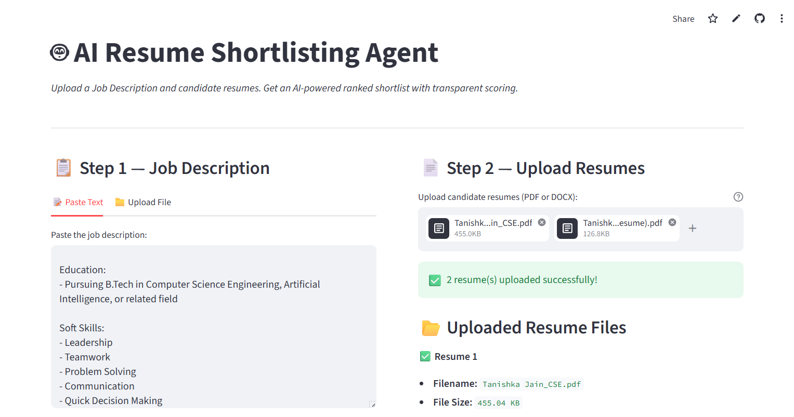
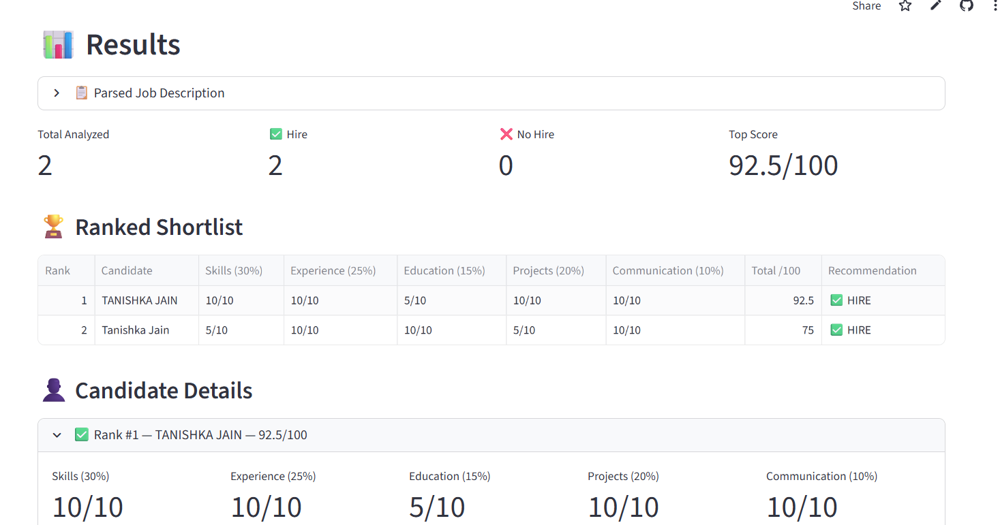

# 🤖 AI Resume & LinkedIn Shortlisting Agent

### AI Enablement Internship Project  
#### Task 1 — HR Resume & LinkedIn Shortlisting Agent

An AI-powered HR screening assistant that ingests a Job Description and multiple candidate resumes, scores each candidate using a transparent 5-dimension rubric powered by Google Gemini, and produces a ranked shortlist report.

## 📸 Screenshots

### Home Page


### Results Dashboard


---

## 📊 Sample Output

Sample HTML Report:  
https://drive.google.com/file/d/1kPVPU1z_1Ghb86td-AaSKRUX00ZC9M6U/view?usp=sharing

---

## 🎥 Demo Video

https://drive.google.com/file/d/1tFAdUUz5MEJjnEl8nAUkyK5SfR-6OpN2/view?usp=drivesdk

---

## 📸 Demo

Upload Job Description → Upload resumes → Click Analyze → Get ranked shortlist with scores, justifications, and downloadable HTML/JSON reports.

🔗 GitHub Repository:
https://github.com/tanishkajain024/ai-resume-shortlisting-agent

🔗 Live Streamlit App:
https://tanishkajain024-ai-resume-shortlisting-agent-app-f4omsb.streamlit.app/

---

## 🏗️ Architecture

```text
┌─────────────────────────────────────────────────────┐
│                    Streamlit UI                     │
│                      app.py                         │
└──────────┬──────────────────────┬───────────────────┘
           │                      │
    ┌──────▼──────┐        ┌──────▼──────┐
    │  JD Parser  │        │Resume Parser│
    │ jd_parser.py│        │resume_parser│
    └──────┬──────┘        └──────┬──────┘
           │                      │
           └──────────┬───────────┘
                      │
               ┌──────▼──────┐        ┌──────────────┐
               │   Scorer    │◄───────│  Validator   │
               │  scorer.py  │        │ validator.py │
               └──────┬──────┘        └──────────────┘
                      │
               ┌──────▼──────┐
               │   Ranker    │
               │  ranker.py  │
               └──────┬──────┘
                      │
           ┌──────────▼───────────┐
           │   Report Generator   │
           │ report_generator.py  │
           └──────────────────────┘
                   │         │
             HTML Report  JSON Report
```

---

## ⚙️ Agent Flow

1. HR uploads Job Description and resumes
2. Gemini parses structured JD requirements
3. Resume parser extracts candidate information
4. Gemini scoring engine evaluates candidates
5. Ranker sorts candidates by weighted score
6. Reports generated in HTML and JSON
7. Human override allows manual HR adjustments

---

## 📋 Scoring Rubric

| Dimension                  | Weight |
| -------------------------- | ------ |
| Skills Match               | 30%    |
| Experience Relevance       | 25%    |
| Education & Certifications | 15%    |
| Projects / Portfolio       | 20%    |
| Communication Quality      | 10%    |

Hire Threshold: **60/100**

---

## 🛠️ Tech Stack

| Layer                 | Technology               |
| --------------------- | ------------------------ |
| Frontend              | Streamlit                |
| Backend               | Python                   |
| LLM                   | Gemini 2.0 Flash         |
| Framework             | LangChain                |
| Resume Parsing        | pdfplumber + python-docx |
| Data Processing       | Pandas                   |
| Environment Variables | python-dotenv            |

---

## 🤖 Why Gemini 2.0 Flash?

* Fast response speed
* Strong JSON output generation
* Free-tier friendly
* Easy Python integration
* Suitable for structured AI scoring pipelines

---

## 🔐 Security Mitigations

## Prompt Injection Protection

* Input sanitization
* Injection pattern detection
* Structured JSON schema validation
* Resume text isolation markers

## API Key Security

* `.env` file storage
* `.gitignore` protection
* No hardcoded credentials

## PII Protection

* Email and phone redaction in logs
* In-memory processing only
* No database storage

## Hallucination Reduction

* Strict JSON output schema
* Score validation layer
* Temperature set to 0.1–0.2
* Human override support

## File Upload Validation

* PDF/DOCX allowlist
* File size checks
* Streamlit sandboxing

---

## 📁 Project Structure

```text
ai_resume_agent/
├── app.py
├── requirements.txt
├── .env.example
├── .gitignore
├── README.md
│
├── modules/
│   ├── validator.py
│   ├── resume_parser.py
│   ├── jd_parser.py
│   ├── scorer.py
│   ├── ranker.py
│   └── report_generator.py
│
├── prompts/
│
└── sample_data/
```

---

## 🚀 Setup Instructions

## Clone Repository

```bash
git clone https://github.com/tanishkajain024/ai-resume-shortlisting-agent.git
cd ai-resume-shortlisting-agent
```

---

## Create Virtual Environment

```bash
python -m venv venv
```

### Windows

```bash
venv\Scripts\activate
```

### Mac/Linux

```bash
source venv/bin/activate
```

---

## Install Dependencies

```bash
pip install -r requirements.txt
```

---

## Configure Gemini API Key

Create `.env` file:

```env
GOOGLE_API_KEY=your_api_key_here
```

Get API Key from:
https://aistudio.google.com/app/apikey

---

## Run Application

```bash
streamlit run app.py
```

Open:

```text
http://localhost:8501
```

---

## 📊 Features Implemented

✅ Job Description Parsing
✅ Resume Upload & Parsing
✅ AI-Based Candidate Scoring
✅ Ranked Shortlisting
✅ Hire / No-Hire Recommendation
✅ Human Override System
✅ HTML & JSON Report Export
✅ Streamlit Dashboard
✅ Security Validation Layer
✅ GitHub + Live Deployment

---

## 🔮 Future Improvements

* LinkedIn profile analysis
* Embedding similarity search
* Vector database integration
* Authentication system
* Multi-user recruiter dashboard
* PDF report export

---

## 👨‍💻 Developed By

Tanishka Jain

Computer Science Engineering Student

AI/ML & NLP Enthusiast

---


## 📄 License

This project was developed as part of the AI Enablement Internship Program for educational, learning, and evaluation purposes.
